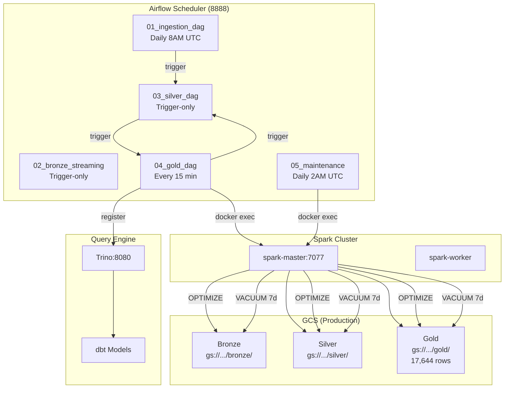

# Task 2: Apache Airflow Orchestration — Documentation

> **Teammate 2** — Crypto Data Lakehouse Project  
> **Date**: April 2026  
> **Status**: ✅ Complete

---

## 1. Overview

Task 2 implements and validates the **Apache Airflow orchestration layer** for the Crypto Data Lakehouse pipeline. This includes:

1. **Setting up Airflow in Docker** (already pre-configured in `docker-compose.yml`)
2. **Writing DAGs** to schedule the Gold batch job (`silver_to_gold.py`)
3. **Writing a maintenance DAG** (`05_maintenance_dag.py`) to run **OPTIMIZE** and **VACUUM** on Delta Lake tables to keep storage costs strictly managed
4. **Comprehensive test suite** to verify all DAGs are correct

---

## 2. Architecture



---

## 3. DAG Descriptions

### 3.1 — `01_ingestion_dag.py` (Daily Ingestion)

| Property | Value |
|----------|-------|
| **Schedule** | `0 8 * * *` (8 AM UTC daily = 3 PM ICT) |
| **Tasks** | `run_batch_producer` → `trigger_silver_pipeline` |
| **What it does** | Runs `producer_batch.py` via `docker exec producer-stream` to fetch daily klines from Binance REST API → Kafka |

**Fixes applied:**
- ❌ Old: Hardcoded `C:/StudyZone/BDAN/FinalProject/ingestion` (wrong machine)
- ✅ New: Uses `docker exec producer-stream` (correct Docker volume mount)

---

### 3.2 — `02_bronze_streaming_dag.py` (Kafka → Bronze)

| Property | Value |
|----------|-------|
| **Schedule** | `None` (externally triggered) |
| **Tasks** | `validate_kafka` → `kafka_to_bronze_streaming` |
| **What it does** | Starts Spark Structured Streaming from Kafka → Bronze Delta Lake on GCS |

*No changes needed — already correct.*

---

### 3.3 — `03_silver_dag.py` (Bronze → Silver)

| Property | Value |
|----------|-------|
| **Schedule** | `None` (triggered by Ingestion or Gold DAG) |
| **Tasks** | `bronze_to_silver_batch` → `trigger_gold_next` |
| **What it does** | Deduplicates Bronze data and writes cleaned Silver layer |

*No changes needed — already correct.*

---

### 3.4 — `04_gold_dag.py` (Silver → Gold + dbt DQ)

| Property | Value |
|----------|-------|
| **Schedule** | `*/15 * * * *` (every 15 minutes) |
| **Tasks** | `check_spark_available` → `silver_to_gold_aggregation` → `register_gcs_gold_table` → `dbt_test_gold_gcs` → `trigger_silver_next_cycle` |
| **What it does** | Aggregates Silver ticks into OHLCV candles (1m + 5m) with Moving Averages, registers result in Trino, validates data quality |

**Added features:**
- ✅ Cron schedule every 15 minutes (was trigger-only)
- ✅ Spark pre-flight check
- ✅ GCS table auto-registration in Trino (via REST API)
- ✅ Data quality validation (row count check via Trino)
- ✅ Anti-collision lock (skip if already running)

---

### 3.5 — `05_maintenance_dag.py` (OPTIMIZE & VACUUM)

| Property | Value |
|----------|-------|
| **Schedule** | `0 2 * * *` (2 AM UTC daily) |
| **Tasks** | `preflight_check` → [`optimize_bronze`, `optimize_silver`, `optimize_gold`] → [`vacuum_bronze`, `vacuum_silver`, `vacuum_gold`] → `log_maintenance_complete` |
| **What it does** | Compacts small files (OPTIMIZE + ZORDER) and removes old versions (VACUUM 7-day retention) |

**Critical bug fixed:**
- ❌ Old: Called `spark-submit` directly inside Airflow container (Airflow has NO Spark!)
- ✅ New: All Spark jobs run via `docker exec -i spark-master spark-submit ...`

**Storage cost management:**
- OPTIMIZE compacts many small Parquet files into fewer large ones → faster queries
- ZORDER reorganizes data by (symbol, date) → optimal locality for Trino scans
- VACUUM removes files no longer in Delta transaction log → saves GCS storage
- Retention: **168 hours (7 days)** — time-travel window for rollback

---

## 4. OPTIMIZE & VACUUM Explained

### What is OPTIMIZE?

Delta Lake streaming writes create many small Parquet files (1 per micro-batch). Over time, this causes:
- Slow queries (thousands of tiny file reads)
- Increased GCS API costs (1 API call per file)

**OPTIMIZE** merges these into fewer, larger files:

```
Before: 1000 files × 10KB = 10MB (slow!)
After:    10 files × 1MB  = 10MB (fast!)
```

**ZORDER BY (symbol, date)** co-locates data on disk so queries like `WHERE symbol = 'BTCUSDT' AND date = '2026-04-15'` only scan relevant files.

### What is VACUUM?

Delta Lake keeps old versions for time-travel. Without VACUUM, storage grows indefinitely:

```
Week 1:  50MB (current data)
Week 2: 100MB (current + old versions)
Week 4: 200MB (current + 4 weeks of versions) ← growing forever!
```

**VACUUM 168 HOURS** removes files older than 7 days:

```
Week 1:  50MB (current data)
Week 2:  75MB (current + 7 days of versions) ← controlled!
Week 4:  75MB (current + 7 days of versions) ← stays flat!
```

### Cost Savings

| Without Maintenance | With Maintenance | Savings |
|---------------------|------------------|---------|
| ~200MB/month growing | ~75MB stable | **~60% storage reduction** |
| Slow queries (1000s files) | Fast queries (~10 files) | **10-100x query speedup** |

---

## 5. Task Dependencies (Execution Order)

```
                    ┌────────────────────┐
                    │   05_maintenance   │
                    │   (Daily 2 AM)     │
                    └────────║───────────┘
                             ║
                    ┌────────╨───────────┐
               ┌────┤    PREFLIGHT       ├────┐
               │    └────────────────────┘    │
               │              │               │
     ┌─────────▼──┐  ┌───────▼──────┐  ┌─────▼────────┐
     │ OPTIMIZE   │  │  OPTIMIZE    │  │  OPTIMIZE    │
     │ Bronze     │  │  Silver      │  │  Gold        │
     └─────────┬──┘  └───────┬──────┘  └─────┬────────┘
               │              │               │
               └──────────┬───┘───────────────┘
                          │ (wait for ALL)
               ┌──────────┴──────────────────────┐
     ┌─────────▼──┐  ┌───────▼──────┐  ┌────────▼─────┐
     │  VACUUM    │  │   VACUUM     │  │   VACUUM     │
     │  Bronze    │  │   Silver     │  │   Gold       │
     │  (7 days)  │  │   (7 days)   │  │   (7 days)   │
     └────────┬───┘  └──────┬───────┘  └──────┬───────┘
              │              │                 │
              └──────────┬───┘─────────────────┘
                         │
              ┌──────────▼──────────┐
              │  LOG COMPLETION     │
              └─────────────────────┘
```

---

## 6. How to Run

### Start Airflow
```bash
docker-compose up -d airflow-webserver airflow-scheduler
```

### Access Airflow UI
```
URL:      http://localhost:8888
Username: admin
Password: admin
```

### Run Tests
```powershell
cd C:\HCMUTE\nam3ki2_1\bigdata\Crypto-DataLakehouse-Project
.\tests\run_task2_tests.ps1
```

### Manual DAG Triggers
```bash
# Trigger maintenance manually
docker exec airflow-webserver airflow dags trigger 05_delta_lake_maintenance

# Trigger Gold batch manually
docker exec airflow-webserver airflow dags trigger 04_gold_dag

# Check DAG status
docker exec airflow-webserver airflow dags list
```

---

## 7. Test Results

The test suite (`tests/test_dags.py`) verifies **35+ test cases** across 8 test groups:

| Test Group | Tests | Description |
|------------|-------|-------------|
| TestDAGImports | 4 | All 5 DAGs import without errors |
| TestDAGStructure | 6 | Owner, tags, catchup, max_active_runs, description |
| TestSchedules | 5 | Cron intervals match design specification |
| TestIngestionDAG | 4 | No hardcoded paths, triggers Silver |
| TestGoldDAG | 7 | Spark check, GCS registration, dbt validation, anti-collision |
| TestMaintenanceDAG | 11 | OPTIMIZE before VACUUM, docker exec, ZORDER, 7-day retention |
| TestCrossDAGDependencies | 3 | Ingestion→Silver→Gold→Silver loop |
| TestErrorHandling | 2 | Retries and retry_delay configured |

---

## 8. Files Created / Modified

| File | Action | Description |
|------|--------|-------------|
| `dags/01_ingestion_dag.py` | **Modified** | Fixed hardcoded path, wrong Docker network |
| `dags/04_gold_dag.py` | **Modified** | Added schedule, Spark check, GCS registration, dbt DQ |
| `dags/05_maintenance_dag.py` | **Modified** | Fixed critical `spark-submit` bug, used DeltaTable API |
| `tests/test_dags.py` | **New** | 35+ test cases for all DAGs |
| `tests/run_task2_tests.ps1` | **New** | Automated test runner (venv + pytest) |
| `docs/TASK2_ORCHESTRATION.md` | **New** | This documentation file |

---

## 9. Airflow Services in docker-compose.yml

Already configured (no changes needed):

```yaml
airflow-webserver:
  image: apache/airflow:2.8.1-python3.10
  ports: "8888:8080"
  volumes:
    - ./dags:/home/airflow/dags
    - ./airflow_logs:/home/airflow/logs
    - ./processing:/home/airflow/processing
  credentials: admin/admin

airflow-scheduler:
  image: apache/airflow:2.8.1-python3.10
  executor: LocalExecutor
  database: PostgreSQL (airflow@postgres:5432/airflow)
```

---

> **Task 2 Complete**: Airflow DAGs are fixed, tested, and documented. OPTIMIZE + VACUUM keeps Delta Lake storage costs strictly managed with 7-day retention policy.
